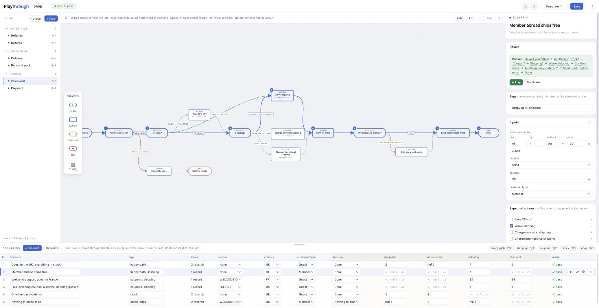

# Playthrough

**Draw the feature before it exists. Then play your scenarios through the drawing.**

A team designing a feature draws a flow on a whiteboard and lists the cases in a spreadsheet: *if
the order came from the app and there is a coupon, then…* The drawing and the spreadsheet never
meet, so nobody notices the case that no branch handles, or two branches that claim the same case,
until the code is written and a tester finds it.

Playthrough puts the drawing and the spreadsheet on one page. You draw the flow as nodes joined by
guarded edges. Each scenario is a row: its inputs, and what should happen. Every row is played
through the drawing as you type, its path lights up, and the row turns green or red. It is a design
tool and is not tied to any code: the flow file it saves is the spec.



[Try it](#try-it) · [Use it with your team](#use-it-with-your-team) · [How a flow works](#how-a-flow-works) · [The page](#the-page) · [The flow file](#the-flow-file) · [Running it](#running-it) · [Development](#development) · [Publishing](#publishing) · [Contributing](CONTRIBUTING.md) · [License](LICENSE)

## Try it

Five minutes. You need [Docker](https://docs.docker.com/get-docker/), or Node 22 or newer.

1. **Start Playthrough.**

   ```bash
   docker run --rm -p 8095:8095 husseinakar/playthrough
   ```

   Or from source:

   ```bash
   git clone https://github.com/hussein-akar/playthrough
   cd playthrough
   npm start -- ./specs
   ```

2. **Open <http://localhost:8095>.** The page is empty: the project folder has no flows in it yet.

3. **Load the example shop.** Click **Template** at the top right, then **Presets**. On the
   **Simple** card, press **Load it**. The *Checkout* flow opens: the drawing in the middle, its four
   scenarios in the table at the bottom. The header says **1 of 4 fail**.

4. **Find out why one fails.** In the table, click the red row, *Phone order (someone assumed an
   email)*. Its path lights up on the drawing: a phone order goes **in person**, to **Print
   receipt**, but the scenario expects **Send confirmation email**. Double-click the row to open it
   in the side panel, where **Result** says what did not match.

5. **Decide who is right.**
   - *The drawing is right:* press **Use this run as the expectation** in the panel. The row turns
     green.
   - *The scenario is right:* click the edge labelled **online** and add `Phone` to its condition,
     so it reads `channel in [Web, App, Marketplace, Phone]`. The row turns green as you type.

Then try these:

- **Play it step by step.** Select a row and press Space, or press ▶ at the end of the row.
- **Let it write the scenarios.** Press **Generate…** above the table, then **Generate**. You get one
  scenario for each way through the drawing, with what the drawing does as the expectation.
- **See a bigger example.** **Template → Presets → Advanced → Load it**: six flows in three groups,
  with lists of records, state set along the way, and a scenario for every branch.

> Run like this, whatever you save lives inside the container and is gone when it stops. The next
> section keeps it on your disk.

## Use it with your team

### 1. Run it on a folder in your repository

From the root of the repository the feature belongs to:

```bash
docker run -d --name playthrough -p 8095:8095 \
  -v "$PWD/specs:/app/specs" \
  husseinakar/playthrough
```

| Part | Why it is there |
|---|---|
| `-d --name playthrough` | Runs in the background. `docker stop playthrough` stops it; `docker start playthrough` starts it again. |
| `-p 8095:8095` | Your browser reaches it at <http://localhost:8095>. |
| `-v "$PWD/specs:/app/specs"` | Every flow is saved as a file in `specs/`, on your disk, so it outlives the container and can be committed. |

**On Linux**, add `--user "$(id -u):$(id -g)"` to the command, so the container can write to
`specs/`. Docker Desktop on macOS and Windows does not need it.

Without Docker, from a checkout of this repository: `npm start -- /path/to/your/repo/specs`.

### 2. Name the project and add a flow

1. The project's name is in the header, next to **Playthrough**. Click it and type a name. It is
   kept in `specs/project.json`.
2. Press **+ Flow** in the sidebar and name the flow. A `/` in the name puts it in a group (a
   subfolder): `Orders/Checkout` is saved as `specs/Orders/Checkout.json`.

### 3. Draw it

1. Drag **Start**, **Action**, **Decision** and **End** from the palette onto the canvas.
2. Select a node, then drag from one of the dots on its side to another node to connect them.
3. Press **Config** at the foot of the palette. Add the **Inputs** a scenario provides (a coupon, a
   channel, a list of order lines) and the **State** your actions leave behind.
4. Click an edge leaving a decision and write its **Condition**, such as `channel in [Web, App]`. The
   **insert…** menu beside it lists every name and value you can use.

### 4. Write the scenarios

- **+ Scenario** adds a row. Fill in its inputs in the table. Double-click the row to set, in the side
  panel, what should happen: the actions, the end it lands on, and the state.
- Or press **Generate…** to write one scenario for each way through the drawing, then fix the rows
  where the drawing is wrong.

### 5. Save and share

- **Save** (or ⌘S / Ctrl+S) writes the flow to its file in `specs/`.
- **Commit `specs/`.** The pull request is the design review, and `git log` is its history. If a file
  changed on disk since you opened it (after a pull, say), the page asks before writing over it.
- For a ticket, **Template → Export → Copy as Markdown** puts the flow on your clipboard as a spec.
  **Copy link** puts the whole flow in a URL that anyone can open.

### In Docker Compose

```yaml
services:
  playthrough:
    image: husseinakar/playthrough
    ports:
      - "8095:8095"
    volumes:
      - ./specs:/app/specs
    restart: unless-stopped
    # On Linux, so the container can write to ./specs. Use your own ids, from `id -u` and `id -g`.
    # user: "1000:1000"
```

Then `docker compose up -d`, and open <http://localhost:8095>.

## How a flow works

### The pieces

| Piece | What it means |
|---|---|
| **Start** | Where a scenario enters. One per flow. |
| **Action** | Something that happens: a document created, an event published. A scenario expects a set of these. An action may also *set* a state field. |
| **Decision** | A fork. Each edge leaving it carries a condition, and one edge may be *else*. |
| **End** | Where a scenario lands. A scenario may expect a particular one. |
| **Inputs** | What a scenario provides, declared once on the flow with a type: enum, boolean, number, text, or a list of records. A condition can only mention declared names, so a typo is caught while drawing. |
| **State** | Fields an action may set along the way and a scenario may check at the end. |

Inputs and state fields share one set of names, and each name belongs to one of them. Declaring the
same name twice is reported as a drawing problem: an input wins wherever a name is read, so a state
field sharing an input's name would be written by an action and never read back, and nothing would
fail to say so.

### Conditions

Conditions read like the sentence in the spreadsheet, and spell the everyday operators the way
code does:

```
channel in (Web, App, Marketplace)
hasCoupon
amount > 100 && !blocked
(faulty || damaged) && hasReceipt
lines.size >= 1
deliveryDate == null
```

Enum values need no quotes. The language has comparisons, arithmetic, `a ?? b` (b when a is blank),
and both spellings of the connectives — `and` / `&&`, `or` / `||`, `not` / `!` — so whichever you
reach for is the one that works. Brackets group: `a || b && c` is `a || (b && c)` until you say
otherwise. A list of values takes brackets or parentheses, `in [Web, App]` and `in (Web, App)`
alike.

**The ƒx button beside every expression box** opens *What you can write here*: every name in scope,
every field of every list, every value an enum takes, the functions with what each one takes, and a
builder for a question about a list. The box itself is at the top, and under it is what the line
comes to when it is run against one of your scenarios — so `lines.count(picked < qty)` says `1`
before you have played anything.

A condition belongs on an edge leaving a decision, because that is the only place it has anything to
choose between. On the way out of a start or an action the panel does not offer the field, and a
condition already there — left behind by a node that used to be a decision — is a drawing problem:
it cannot send the run one way or the other, it can only stop it. Make the node a decision, or empty
the field.

The panel checks a condition as you type: a name nobody declared, or a missing bracket, shows up
under the field at once. Renaming an input or a state field rewrites every condition, set and
scenario cell that mentions it, in one undoable step.

### Lists of records

A list input is declared with its fields: `lines`, where `status` is an enum of PICKED, SHORT and
CANCELLED, and `gift` is a boolean. A scenario writes one record per line, as `status=PICKED,
gift=yes` or just the values in field order, `PICKED, yes`. In the side panel each record is a row of
controls.

A list answers `.size`, and is asked about with `filter`, `count`, `any`, `all` and `none`. Each
takes a condition on one record, and inside the brackets a bare word is a field of that record:

```
lines.size >= 1                          how many there are
lines.filter(status != CANCELLED)        the ones that match — an action's set
lines.count(gift) > 1                    how many match
lines.any(status == SHORT)               at least one
lines.all(status == PICKED)              every one; an empty list is all of them
lines.none(gift)                         not one
```

A field the list does not declare is caught as you type. An empty list is false, so
`lines.filter(gift)` reads "some line is a gift".

**When a field and an input are called the same thing**, a bare word is the field, and nothing on
the page says so. Name the record and it becomes the only way to reach it:

```
lines.filter(o -> o.qty > qty)      o.qty is the line's; a bare qty is the input
```

Under a name, the record is `o` and nothing else, so either meaning can be written down. A bare word
that would be read both ways at once is reported as a problem on the drawing, with both spellings
offered — the flow runs, but it does not say which it meant, and a specification has to.

The older spellings still work and still mean the same, because flows live in people's
repositories: `lines where status != CANCELLED` is `lines.filter(…)`, and `count(lines)` is
`lines.size`.

### State

A state field starts as its **initial value**. That is taken as written (`0`, `null`, `pending`),
unless it is an expression over the inputs: `lines` starts as a copy of the input `lines`, and
`lines.filter(gift)` as the gift lines only.

The fields are worked out **in the order they are declared**, and each may build on the ones above
it — `open` can be `lines.filter(status != CANCELLED)`, and `urgent` below it `open.filter(rush)`.
Only the ones above: a field cannot start as something not worked out yet. One that reaches down the
list, or at itself, is reported as a drawing problem naming the field to move, rather than quietly
starting as the text of its own definition and failing at the first action that reads it. An action changes a field with a *set*, such as `discount = 10`.

### How a scenario is played

At each node the runner looks at the edges leaving it. Exactly one must match: the one whose
condition holds, or the *else* edge when none does. Anything else stops the run, and the node where
it stopped is painted red:

| Finding | Meaning |
|---|---|
| *ambiguous* | Two edges match. |
| *nothing matched* | No edge matches and there is no *else*. |
| *leads nowhere* | The node has no way out and is not an End. |
| *loop* | The run is still going after 500 steps. |

A scenario **passes** when every expected action happened, nothing unexpected happened, it landed on
the expected End, and every expected state field holds. An expected state cell can be:

| Cell | Holds when the field is |
|---|---|
| `*` | anything but null |
| `null` | null |
| `100`, `UK` | that value |
| `== 1`, `> 100`, `size > 0` | true for that check; for a list, on how many records it has |
| `count(lines where gift) == 1`, `lines where status == PICKED` | true for that expression |
| the name of an input | the same as that input |

## The page

### The header

- **Playthrough**, then the flow's name (or, in a project, the project's name). Click it to rename.
- Pills that say how the flow stands: **unsaved changes**, **all 4 pass** or **1 of 4 fail**, and **2
  drawing problems** (click it to go to the first).
- **Undo** and **redo**, the **Template** menu, **Save**, and **?**, which lists every key.

### Drawing

- **Add a node:** click a shape in the palette to drop it in the middle, or drag it to where it
  should go. Double-click a node to edit its label.
- **Connect:** select a node, then drag from a dot on its side to another node. Drag an end of a
  selected wire to move it; drag the wire itself to route it around something.
- **An edge's look:** a label shown instead of the condition, a status colour (success, failed,
  warning, info), and a smooth or square line, from the small bar over a selected wire or the panel.
- **Move around:** the wheel or two fingers pan; ⌘-wheel or a pinch zooms; hold Space or the middle
  button to drag the view. The bar over the canvas has **Tidy** (lay the flow out from the start),
  **Fit**, and the zoom.
- **Select several:** drag on empty canvas, Shift-click, or ⌘A. Then drag, nudge with the arrow keys,
  copy (⌘C), cut (⌘X), paste (⌘V), duplicate (⌘D), delete, or line them up from the panel.
- **The flow's own settings:** press **Config** in the palette. The panel shows the flow's name and
  description and its inputs and state; a pencil opens the drawer where they are edited.

### Scenarios

- **Select** a row with a click: its path lights up on the drawing. ↑ and ↓ move to the next one.
- **Open** it in the side panel with a double-click, or ✎ at the end of the row. The panel has its
  name, description, result, tags, inputs, and what it expects.
- **Play** it step by step with ▶ at the end of the row, or Space.
- **Duplicate** (⧉), **delete** (×), or **move** it: on hover the row number becomes a grip to drag.
- **Accept a run:** when a scenario fails and the drawing is right, **Use this run as the
  expectation** in the panel (or **accept run** in the row) copies what happened into what it expects.
- **Tags**, such as `edge` or a ticket number, go in the panel. Each tag shows above the table with
  its pass count; click one to show only its scenarios.

### Generate…

**Generate…** writes scenarios from the inputs. The values come from the drawing: an enum's values,
yes and no for a boolean, and for numbers and text the constants the conditions compare them with
(`amount > 100` gives 100 and 101). A list gets no records, one record of each kind, and one of
each together.

In the dialog, every input shows its values as chips. Click a value to leave it out; ⌥-click
(Alt-click) keeps only that one. Then:

- **One for each way through the drawing** (the default): combinations that take the same edges to
  the same end are written once. On the Advanced checkout that is 15 scenarios instead of 96, and
  they touch every node and edge the 96 would.
- **One for every combination** writes all of them.

Ways (or combinations) a scenario already covers are left out, unless you untick **Leave out…** in
the dialog. Each new one is tagged `generated`, described with the
branches it took, and expects what the drawing did, so the table documents the drawing and you fix
the rows where it is wrong. A combination that no branch handles comes out *stuck*: the case nobody
drew.

### The project sidebar

Shown when Playthrough runs on a folder. Every `*.json` in the folder and its subfolders is a flow.

- Click a flow to open it. Its dot and count say how its scenarios stand (`5/7`).
- **+ Flow** creates one, **+ Group** creates a folder, and a group's **+** creates a flow inside it.
- Drag a flow or a group onto a group to move it there, or onto empty space to move it to the top.
- On hover, ✎ renames and × deletes, after asking.
- « at the left of the bar over the canvas hides the sidebar; » brings it back.

### Saving, importing and exporting

| Where | What it does |
|---|---|
| **Save**, ⌘S | In a project: writes the flow to its file. Without a project folder: downloads it as JSON. |
| **Template → Import → Open a file…** | Opens a flow's `.json` from your computer. Dropping the file on the page does the same. |
| **Template → Import → From JSON** | Opens a flow from JSON you paste. |
| **Template → Export → Copy link** | Puts the whole flow in a URL (compressed; nothing is uploaded). |
| **Template → Export → Copy as JSON** | Puts the flow's JSON on your clipboard. |
| **Template → Export → Copy as Markdown** | Puts the flow on your clipboard as a spec: inputs, state, every decision and the scenario table with each result. |
| **Template → Export → Download as JSON** | Downloads the flow's file. |

The browser also keeps the flow you are working on between reloads, but that is not a save: the
**unsaved changes** pill stays until you press **Save**, and the page asks before you close it.

### Presets

**Template → Presets** offers three starting points, kept in `examples/`:

| Preset | What is in it |
|---|---|
| **Empty** | A blank canvas. In a project, loading it empties the folder. |
| **Simple** | A shop in two flows, *Checkout* and *Returns*. One scenario fails on purpose. |
| **Advanced** | The same shop in six flows and three groups: orders, fulfilment and after-sale, with lists of records, state, labelled and coloured edges, and a scenario for every branch. |

**Load it** replaces what is in the project folder with the preset, after asking. **Add to this one**
writes the preset's flows next to yours, under a group named after the preset.

### Keys

Press **?** on the page for the same list.

| Key | Does |
|---|---|
| ⌘Z · ⇧⌘Z | undo · redo |
| ⌘S | save |
| Delete, Backspace | delete what is selected |
| Esc | clear the selection |
| F | fit the drawing to the window |
| Space | play the selected scenario; hold and drag to pan |
| ↑ · ↓ | the scenario above · below |
| arrow keys · ⇧ arrow keys | nudge the selected nodes by one grid step · five |
| ⌘A · ⌘C · ⌘X · ⌘V · ⌘D | select every node · copy · cut · paste · duplicate |
| double-click a node | edit its label |
| double-click a scenario row | open it in the side panel |
| Alt while dragging a node | place it off the grid |
| right-click the canvas | add a shape, paste, copy, cut, duplicate, delete |

On Windows and Linux, use Ctrl for ⌘.

## The flow file

A flow is one JSON file, small enough to read in a diff and to write by hand or generate:

```json
{
  "name": "Checkout",
  "inputs": [{ "name": "channel", "type": "enum", "values": ["Web", "App", "Phone"] },
             { "name": "hasCoupon", "type": "boolean" }],
  "state":  [{ "name": "discount", "initial": null }],
  "nodes":  [{ "id": "start", "kind": "start", "label": "Order placed", "x": 80, "y": 220 },
             { "id": "apply", "kind": "action", "label": "Apply coupon",
               "x": 800, "y": 120, "set": { "discount": "10" } }],
  "edges":  [{ "id": "e3", "from": "coupon", "to": "apply", "when": "hasCoupon" },
             { "id": "e4", "from": "coupon", "to": "full", "else": true }],
  "scenarios": [{ "name": "Web order with a coupon",
                  "description": "The common case; the coupon takes ten off",
                  "tags": ["happy path"],
                  "inputs": { "channel": "Web", "hasCoupon": true },
                  "expect": { "actions": ["Reserve stock", "Apply coupon"],
                              "end": "Done", "state": { "discount": "*" } } }]
}
```

[`examples/simple/checkout.json`](examples/simple/checkout.json) is a whole one, and
[`examples/advanced/`](examples/advanced) has flows with lists, state, and labelled, coloured edges.
A project folder may also hold a `project.json` with the project's name: `{ "name": "Shop" }`.

## Running it

### Docker

```bash
docker run -d --name playthrough -p 8095:8095 -v "$PWD/specs:/app/specs" husseinakar/playthrough
```

| | |
|---|---|
| **Image** | `husseinakar/playthrough`, for `linux/amd64` and `linux/arm64` |
| **Tags** | `latest` (the main branch), `1.2.3` (a release), `1.2` (the newest 1.2.x) |
| **Port** | `8095` inside the container |
| **Project folder** | `/app/specs`; mount yours there |
| **User** | `node` (uid 1000). On Linux, run as yourself with `--user "$(id -u):$(id -g)"` so a mounted folder is writable. |
| **Health check** | `GET /health` answers `{"status":"UP"}`; `docker ps` shows the container as healthy |

To use another port on your machine, change the left side only: `-p 9000:8095`, then open
<http://localhost:9000>.

To update: `docker pull husseinakar/playthrough`, then remove the container and run it again. Your
flows are in the mounted folder, not the container.

### From source

Node 22 or newer. There is nothing to install: no dependencies, no build step.

| Command | What it does |
|---|---|
| `npm start` | The page at <http://localhost:8095>, one flow at a time, without a project folder |
| `npm start -- ./specs` | The page over a project folder, created if it does not exist |
| `npm run start:example` | The page over the Advanced preset's six flows |
| `npm test` | The test suite |

### Environment variables

| Variable | Default | What it does |
|---|---|---|
| `PORT` | `8095` | The port the server listens on. |
| `PLAYTHROUGH_DIR` | none from source; `/app/specs` in Docker | The project folder. A folder given on the command line wins. In Docker, set it to empty (`-e PLAYTHROUGH_DIR=`) to run without one. |

### The HTTP API

The page talks to the server over a small API, which scripts can use too. A path inside the project
is URL-encoded, slashes included.

| Route | Does |
|---|---|
| `GET /health` | `{"status":"UP","version":"1.1.1","project":"<name>"}` |
| `GET /api/project` | The project's name, folder, flows (with pass counts) and groups |
| `PUT /api/project` | Renames the project: `{"name":"Shop"}` |
| `GET /api/flows/:file` | Reads a flow |
| `PUT /api/flows/:file` | Writes a flow: `{"doc":{…},"ifMtime":…}`; answers 409 if the file changed since `ifMtime` |
| `POST /api/flows` | Creates a flow: `{"name":"Orders/Checkout","doc":{…}}` |
| `POST /api/flows/:file/rename` | Renames or moves a flow: `{"name":"…","folder":"…"}` |
| `DELETE /api/flows/:file` | Deletes a flow |
| `POST /api/folders` | Creates a group: `{"path":"Orders"}` |
| `POST /api/folders/:path/rename` | Renames or moves a group |
| `DELETE /api/folders/:path?all=1` | Deletes a group; `all=1` deletes what is in it too |

There is no authentication: run it on your machine or a trusted network.

## Development

Node 22 or newer, and nothing to install:

```bash
npm test                    # the test suite
npm start -- ./specs        # the page over a scratch project folder (ignored by git)
docker build -t playthrough . && docker run --rm -p 8095:8095 playthrough   # the image
```

[CONTRIBUTING.md](CONTRIBUTING.md) has the rest: the no-dependencies rule, where things are in the
code, what the tests cover, how commit messages cut releases, pull requests, and how to report a bug
or a vulnerability.

## Publishing

The image is built and published by [`.github/workflows/image.yml`](.github/workflows/image.yml).

### What happens, and when

| Event | What the workflow does |
|---|---|
| A pull request | Runs the tests on Node 22, 24 and 26, builds the image and smoke-tests it. Publishes nothing. |
| A push to `main` | The same, then publishes `husseinakar/playthrough:latest` for amd64 and arm64 and updates the Docker Hub page from [`README.docker.md`](README.docker.md). |
| …with a `feat:`, `fix:` or breaking commit since the last release ([which commits count](CONTRIBUTING.md#commit-messages-which-cut-releases)) | Also works out the next version, publishes `:1.3.0` and `:1.3` (with that version in the image's `package.json`), and tags the commit `v1.3.0`. Nothing is committed back to `main`. |
| A `v*` tag pushed by hand | Publishes that version's tags, with that version in the image's `package.json`. |

The smoke test starts the image with a folder mounted, as a Linux user would, and checks that it
answers `/health`, serves the page and the presets, and writes a flow into the folder.

### One-time setup

1. **Create the GitHub repository** and push to it:

   ```bash
   gh repo create hussein-akar/playthrough --public --source . --push
   ```

   Or create it on github.com, then `git remote add origin git@github.com:hussein-akar/playthrough.git`
   and `git push -u origin main`.

2. **Create a Docker Hub access token.** On hub.docker.com: **Account Settings → Personal access
   tokens → Generate new token**, with the permission **Read, Write, Delete**. (Read & Write is
   enough to push, but not to update the repository's description, and Docker Hub refuses a narrower
   token with a `Forbidden` that looks like a wrong password.)

3. **Add two repository secrets.** On GitHub: **Settings → Secrets and variables → Actions → New
   repository secret**:

   | Name | Value |
   |---|---|
   | `DOCKERHUB_USERNAME` | `husseinakar` |
   | `DOCKERHUB_TOKEN` | the token from step 2 |

   Or from the terminal:

   ```bash
   gh secret set DOCKERHUB_USERNAME --body husseinakar
   gh secret set DOCKERHUB_TOKEN          # paste the token when asked
   ```

4. **Run the workflow.** Push to `main`, or start it by hand: **Actions → image → Run workflow**. The
   first run publishes `latest` and, because the history holds `feat:` commits, releases `v0.1.0`.
   Docker Hub creates the `husseinakar/playthrough` repository on that first push.

`main` is protected by a ruleset: every change is a pull request with the maintainer's approval and
passing checks (see [CONTRIBUTING.md](CONTRIBUTING.md#pull-requests)). A release only pushes a tag,
so the workflow needs no exception to it.

### Releasing by hand

Merge commits with a `feat:` or `fix:` subject and the next push to `main` releases on its own. To
release a specific version instead:

```bash
git tag -a v1.0.0 -m "v1.0.0"
git push origin v1.0.0
```

## Contributing

Bug reports, questions and pull requests are welcome. Read [CONTRIBUTING.md](CONTRIBUTING.md) first:
it is short, and it explains the one rule (no dependencies) and how a commit message decides a
release.

## License

Copyright 2026 Hussein Akar. Licensed under the [Apache License, Version 2.0](LICENSE).
